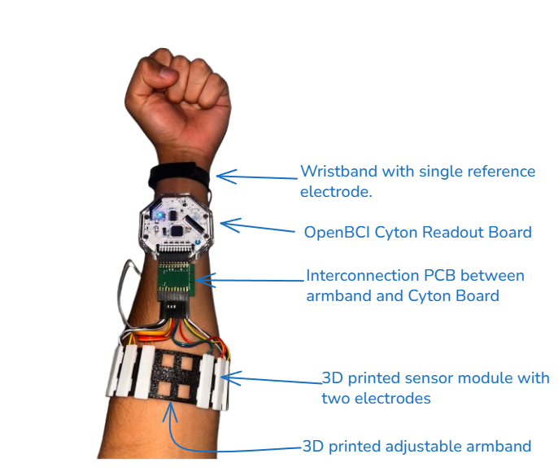

# A Modular 3D-Printed sEMG Armband for Real-Time Gesture Recognition

This repository contains the core hardware designs, and machine learning notebooks for a final year project at Imperial College London. The project delivers a complete, low-cost, and open-source system for classifying hand and wrist gestures from surface electromyography (sEMG) signals in real-time.

The primary goal is to address the limitations of expensive, proprietary, and inflexible commercial sEMG systems by providing an accessible and highly adaptable platform for researchers, students, and hobbyists.

---

## Key Features

* **Extremely Low-Cost Hardware:** The 3D-printable armband and sensor modules cost only **~£6** to fabricate, serving as a low-cost add-on for the OpenBCI Cyton board.
* **Fully Modular Design:** Unlike fixed-sensor armbands, the sensor pods can be positioned anywhere on the band, allowing for an optimised, user-specific fit that improves signal quality.
* **High Classification Accuracy:** The accompanying machine learning pipeline achieves **97.49% test accuracy** in classifying six distinct hand and wrist gestures.
* **Fully Open Source:** All hardware designs (`.stl`, Fusion 360 files), software, datasets, and documentation are publicly available to encourage further research and development.
* **End-to-End Real-Time System:** The project includes separate, documented applications for data collection and live, low-latency gesture classification.

---

## Hardware Overview

The system is designed around a custom 3D-printed armband that houses up to eight bipolar sEMG sensors.

| Assembled System |
| :---: |
|  |
| The complete system worn on the forearm, connected to the OpenBCI Cyton board. |

All `.3mf` and source CAD files for 3D printing are available in the `/hardware` directory of this repository. For full assembly instructions, please see the User Guide in the final report.

---

## Project Structure & Repositories

This project is split across three repositories to keep the code organized:

1.  **This Main Repository (`sEMG-Forearm-Classification`)**
    * You are here! This repo contains:
        * `/hardware`: All CAD files (`.3mf`) for the 3D-printable components.
        * `/notebooks`: Jupyter notebooks detailing the machine learning workflow, from data preprocessing to model training and evaluation.
        * `Final Report.pdf`: The complete project report detailing the design, implementation, and results. The User Guide section is especially helpful for those who want to recreate this setup.

2.  **Data Collection Application**
    * A Python `Tkinter` application used to guide users through the data collection protocol and generate timestamped labels.
    * **[-> Go to Data Collection App Repository](https://github.com/LilOz/EMGPromptApp)**

3.  **Real-Time Classification Application**
    * A multi-threaded Python application with a GUI for visualizing live sEMG data and classifying gestures in real-time using a pre-trained model.
    * **[-> Go to Real-Time App Repository](http://github.com/LilOz/emg-realtime-classification)**

---

## Software Workflow

The end-to-end process for using this system involves three main steps:

1.  **Data Collection:** Use the **Data Collection App** alongside the official OpenBCI GUI to record raw, timestamped sEMG signals and their corresponding gesture labels. A provided Python script then merges these sources to create the final labelled dataset.

2.  **Model Training:** Use the **Jupyter Notebooks** in this repository to train your own classification model. The notebooks guide you through the pipeline: filtering the raw data, extracting the optimal feature set, and training the final MLP model.

3.  **Real-Time Classification:** Load your trained model into the **Real-Time Classification App** to see live predictions. The app provides visual feedback and demonstrates the low-latency performance of the system.

---

## How to Cite

If you use this work in your own research, please cite the final report:

> [A. Osman]. (2025). *Electromyography (EMG) Signal Pattern Classification with a Modular 3D-Printed Signal Acquisition Armband*. Final Year Project Report Supervised by Prof. K. Fobeletes, Department of Electrical and Electronic Engineering, Imperial College London.

## License

This project is licensed under the MIT License. See the `LICENSE` file for details.

## Acknowledgements

I would like to thank my supervisor, Professor Kristel Fobelets, for her absolutely invaluable guidance and support throughout this project. You were awesome!
